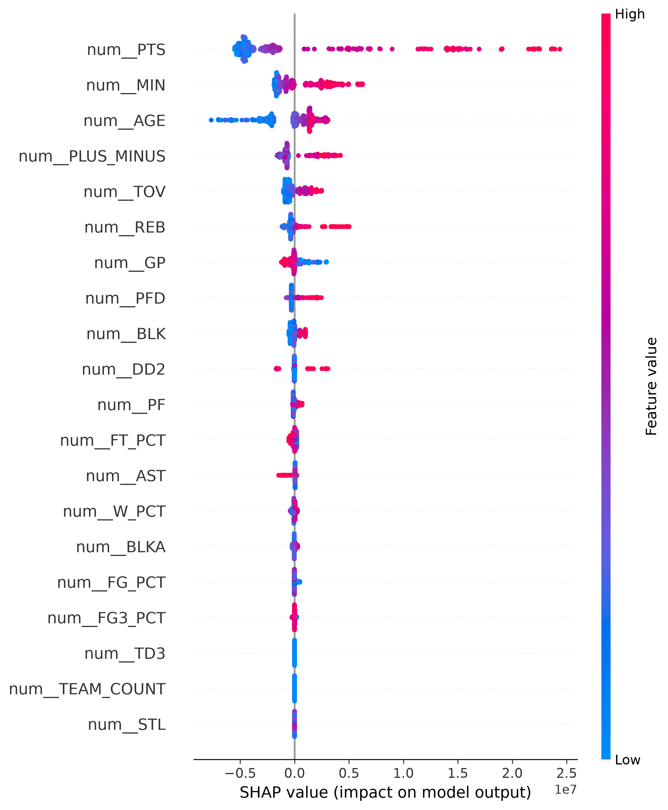
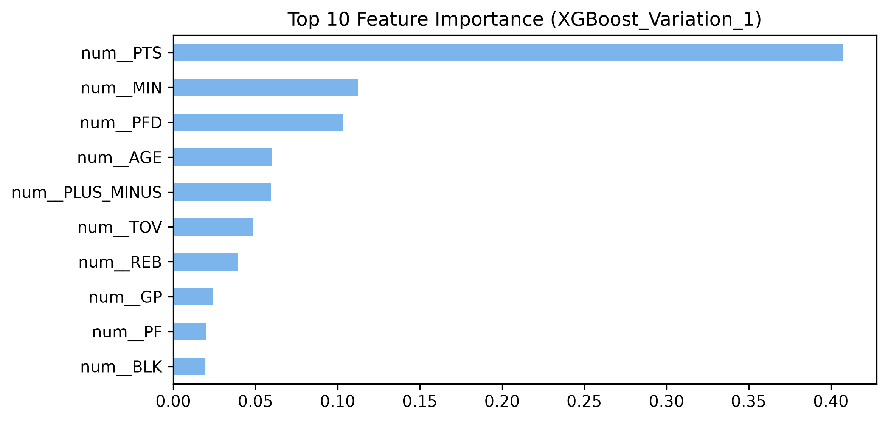

# NBA Player Salary Prediction (2025-26 Season)

**[Canlı Uygulamayı İncele (Live Demo)](https://saltman00.github.io/NBA-salary-analysis/)**

A machine learning project that predicts NBA player salaries based on their in-game performance statistics. This project demonstrates an end-to-end data science pipeline: from web scraping and data wrangling to feature engineering, predictive modeling, LLM-powered scouting reports, and an interactive web dashboard.

## Project Overview

| Step | Description |
|------|-------------|
| **Data Collection** | Player stats from the official NBA API + salary data scraped from Basketball Reference |
| **Feature Engineering** | Correlation analysis, VIF-based multicollinearity removal, manual feature selection |
| **Modeling** | XGBoost, Random Forest, LightGBM, Ridge, Lasso, and a Stacking Ensemble |
| **Evaluation** | 5-Fold Stratified Cross-Validation, Out-Of-Fold (OOF) tracking, SHAP explainability, per-player error analysis |
| **LLM Integration** | Automated scouting reports generated via LangChain + Groq (GPT-OSS-120B) for every player |
| **Web Dashboard** | Interactive player lookup with Chart.js visualizations (Scatter Plot & Bar Chart) |

## Methodology & Approach

This project strictly adheres to professional machine learning best practices to prevent data leakage and ensure realistic results:

- **Robust Data Filtering:** Players with fewer than 15 games played (`GP < 15`) were filtered out to remove statistical anomalies (e.g., 10-day contract players skewing per-game averages).
- **Addressing Multicollinearity (VIF):** Basketball statistics are inherently highly correlated (e.g., Minutes Played vs. Points). We utilized Variance Inflation Factor (VIF) analysis to systematically identify and remove redundant features. This reduced dimensionality and increased model stability without sacrificing predictive power.
- **Continuous Target Stratification:** Player salaries were divided into 5 discrete quantiles (`pd.qcut`) to allow `StratifiedKFold`. This ensures that every cross-validation fold has an equal representation of high-earning superstars and minimum-contract players.
- **Leakage-Free Pipeline:** Data scaling (`StandardScaler`) and encoding (`OneHotEncoder`) were placed inside a scikit-learn `Pipeline` alongside the model. This guarantees that feature transformations are learned only on the training folds and applied blindly to the validation folds.
- **Out-of-Fold (OOF) Predictions:** Instead of evaluating models on data they have already seen (which causes artificial overfitting), we use `cross_val_predict` to generate predictions for players *only* when they are in the hold-out test set. The reported metrics reflect the true, unbiased market value predictions.

## Model Results (Out-of-Fold Predictions)

We compared 5 standalone models and a Meta-Model Stacking Ensemble. 

| Model | R² Score | RMSE ($) | MAE ($) |
|-------|----------|----------|---------|
| **XGBoost** | **0.7142** | **$7,819,487** | **$5,436,878** |
| Stacking Ensemble | 0.7045 | $7,952,336 | $5,476,356 |
| Random Forest | 0.6915 | $8,124,617 | $5,770,531 |
| LightGBM | 0.6745 | $8,345,928 | $5,684,153 |
| Ridge | 0.6528 | $8,619,598 | $6,268,284 |
| Lasso | 0.6464 | $8,698,836 | $6,338,584 |

> [!NOTE]
> **Why did XGBoost beat the Ensemble?**
> We built a Stacking Ensemble combining XGBoost, Random Forest, and Lasso, utilizing Ridge as the final meta-estimator. However, XGBoost alone slightly outperformed the ensemble. This often happens when the base models are highly correlated in their predictions, meaning the ensemble doesn't gain any new "perspectives" and instead just dilutes the sheer predictive power of the best standalone model (XGBoost).

## Key EDA Insights (Data Storytelling)

During the correlation analysis, several highly correlated feature pairs (>0.80) were discovered. Beyond the obvious ones (like Made Shots vs. Points), the data revealed some interesting basketball truths:

- **The Playmaker's Dilemma (AST & TOV - 0.85):** High assist numbers strongly correlate with high turnovers. Handling the ball and creating plays inherently carries a high risk of losing it.
- **The Superstar Whistle (PFD & PTS - 0.89):** Personal Fouls Drawn (PFD) is heavily correlated with Total Points. The league's top scorers aren't just great shooters; they are masters at drawing fouls and getting to the free-throw line.
- **Defense Dictates Rebounds (DREB & REB - 0.96):** Defensive rebounds heavily skew the total rebound count compared to offensive rebounds (0.81), showing that top rebounders pad their stats primarily under their own basket.
- **The Rookie Scale Illusion:** When analyzing the largest prediction errors ("Underpaid" players), the model heavily overvalues young superstars. This is mathematically correct but practically flawed because the model is unaware of the NBA's CBA (Collective Bargaining Agreement) which artificially caps rookie contracts.
- **The "Ultramega Superstar" Outlier Effect:** Generational talents (e.g., Jokić, Dončić, Antetokounmpo) literally break the model's boundaries. Because their stats exist so far outside the normal distribution, the model often predicts their true market value to be significantly higher than the NBA's actual "Max Contract" cap. They are simply too good for standard regression limits.
- **The Injury Bug (2025-26 Season):** Several major All-Stars played around 20-30 games this season due to injuries. Since they passed our 15-game filter, their per-game stats look like superstar stats, but their total impact is lower. This created fascinating edge cases for the model when predicting their true market value.

## LLM-Powered Scouting Reports

After the XGBoost model generates salary predictions, we use **LangChain + Groq (GPT-OSS-120B)** to automatically write professional scouting reports for each player. The LLM receives:
- The player's actual salary vs. model prediction
- The financial verdict (Overpaid / Underpaid)
- The top 3 statistical drivers from the model

It then generates a 2-3 sentence, front-office-style contract evaluation explaining *why* the player has that valuation.

> [!NOTE]
> The scouting reports for "Fairly Paid" players (within ±10% of their actual salary) are hidden on the web dashboard, since the LLM only receives binary Overpaid/Underpaid labels and cannot accurately justify a "fair" verdict.

## Interactive Web Dashboard

A fully static web application (HTML/CSS/JS) that lets users:
- **Search** for any NBA player and view their salary prediction, verdict, and scouting report
- **Explore** two interactive Chart.js visualizations:
  - **Scatter Plot:** Actual vs Predicted salary for all players, with a ±10% "Fairly Paid" corridor
  - **Bar Chart:** Top 10 Most Overpaid and Top 10 Most Underpaid players

The dashboard requires no backend server — just open `docs/index.html` in a browser via a local server (e.g., VS Code Live Server).

## Key Visualizations

### Feature Distributions vs Salary
Shows the distribution of all numeric features in the dataset and their bivariate relationship with the mean target variable (Salary).


### SHAP Analysis (XGBoost)
Shows which features have the strongest impact on salary predictions:



### Feature Importance (XGBoost)


## Project Structure

```
NBA_project/
├── README.md
├── requirements.txt
├── .gitignore
├── .env.example              # Template for API keys (copy to .env and fill in)
├── data/
│   ├── nba_stats_2025_26.csv         # Player performance stats (464 players, 67 features)
│   └── nba_salaries_2026_27.csv      # Player salary data
├── notebooks/
│   ├── 01_data_collection.ipynb      # Step 1: Data fetching & merging
│   ├── 02_eda_feature_engineering.ipynb  # Step 2: EDA, correlation, VIF analysis
│   ├── 03_modeling.ipynb             # Step 3: Model training & evaluation
│   ├── 04_llmrag.ipynb               # Step 4: LLM scouting report generation
│   └── 05_visualizations.ipynb       # Step 5: Matplotlib/Seaborn visualizations
├── outputs/
│   ├── plots/                        # Feature importance, SHAP, distribution plots
│   ├── metrics/                      # Model performance metrics (txt)
│   └── predictions/                  # Per-player salary predictions (xlsx)
└── docs/
    ├── index.html                    # Main dashboard page
    ├── style.css                     # Styling (Clinical Light Mode)
    ├── script.js                     # Search logic + Chart.js visualizations
    └── data/
        └── predictions.json          # Full player data with LLM analyses
```

## Installation & Setup

```bash
# 1. Clone the repository
git clone https://github.com/YOUR_USERNAME/NBA_project.git
cd NBA_project

# 2. Create a virtual environment
python -m venv venv
source venv/bin/activate  # Linux/Mac
# venv\Scripts\activate   # Windows

# 3. Install dependencies
pip install -r requirements.txt

# 4. Set up API keys (for LLM notebook only)
cp .env.example .env
# Edit .env and add your LangSmith and Groq API keys
```

## Usage

Run the notebooks in order:

1. **`01_data_collection.ipynb`** — Fetches live data from NBA API and scrapes salary data
2. **`02_eda_feature_engineering.ipynb`** — Explores the data, removes multicollinearity
3. **`03_modeling.ipynb`** — Trains all models, generates predictions and SHAP plots
4. **`04_llmrag.ipynb`** — Generates LLM-powered scouting reports for all players
5. **`05_visualizations.ipynb`** — Creates Matplotlib/Seaborn visualizations

To view the web dashboard, open `docs/index.html` using a local server (e.g., VS Code Live Server extension).

## Data Sources

- **Player Statistics**: [NBA Official API](https://www.nba.com/) via [`nba_api`](https://github.com/swar/nba_api) Python package
- **Salary Data**: [Basketball Reference](https://www.basketball-reference.com/contracts/players.html) (web scraping)

## Tech Stack

- **Language**: Python 3.10+
- **ML Frameworks**: scikit-learn, XGBoost, LightGBM
- **Explainability**: SHAP
- **LLM**: LangChain, Groq (GPT-OSS-120B)
- **Data**: pandas, NumPy
- **Visualization**: Matplotlib, Seaborn, Chart.js
- **Web**: HTML, CSS, JavaScript
- **Statistical Analysis**: statsmodels (VIF)
